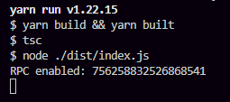

# eZaR Rich Presence Status

### This code is suppose to just show a pop-up on my account showing eZaR's website and support in a button form. It should look something like this:

# Getting Started
Simply just remove the `.example` from [.env.example](/.env.example) and make it `.env`, then replace `...` with **YOUR** Discord bot ID. Then, run: `yarn install` and then `yarn start` once its all done. It should then show this:

**Please note that you have to have a Discord Desktop(stable, ptb, canary, or development) opened for this to work. it does NOT work for Discord mobile or Discord on browser.**